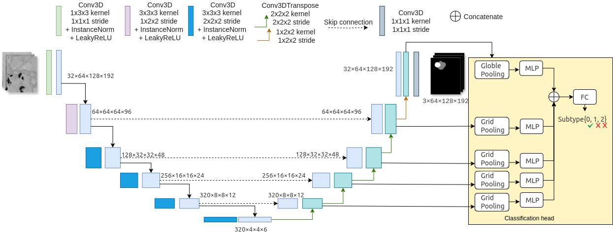

# nnUNet_3DCT
## Pancreas Lesion Segmentation and Classification with nnU-Net v2

This repository contains scripts and configurations for training and evaluating a **multi-task deep learning model** for **pancreas cancer segmentation and classification** from 3D CT scans.  
The approach extends **[nnU-Net v2](https://github.com/MIC-DKFZ/nnUNet)** with a **classification head** for lesion subtype prediction.  
We explore methods to improve classification accuracy and inference efficiency




## Setup

Before running training or inference, set the following environment variables:

```bash
export nnUNet_raw="/path/to/nnUNet_raw"
export nnUNet_preprocessed="/path/to/nnUNet_preprocessed"
export nnUNet_results="/path/to/nnUNet_results"
```

Preprocess and check dataset integrity:

```bash
nnUNetv2_plan_and_preprocess -d 1 --verify_dataset_integrity
```

Note: if you use T4 GPU on colab, this will give you batch size 3 for your plans.json, which could influence the training. We suggest to train the model with A100 GPU for batch size > 8.

## Pre-trained Weights

Download the pre-trained weights here for stage 1 (segmentation only):
[pretrained_model_stage1.pth](https://drive.google.com/file/d/1kjE-K2zZ7JNzePiKcN4XPfm_ZctvmYY3/view?usp=sharing)

Download the pre-trained weights here for stage 2 (multi-task: segmentation and classification):
[pretrained_model_stage2.pth](https://drive.google.com/file/d/13tbgtirXdxdkgwsDelrkoXT6E5GQTKTa/view?usp=sharing)

## Training

Follow the instructions or use **[train.sh](train.sh)** to conduct training.

### Stage 1: Train Segmentation Only
Only train segmentation branch using lesion and pancreas masks as supervision.

```bash
nnUNetv2_train Dataset001_3DCT 3d_fullres 0 --npz
```

### Stage 2: Train Jointly with Classification

#### Train from Scratch

Train the segmentation head with classification head together from scratch.

```bash
export NNUNETV2_MT_NUM_CLS=3
export NNUNETV2_MT_LOSS_WEIGHT=0.3

nnUNetv2_train Dataset001_3DCT 3d_fullres 0 \
  -tr nnUNetTrainer_CLSHeadSum -p nnUNetPlans --npz
```

#### Fine-tune from stage 1 Pre-trained

Fin-tune the classification head and original nnUNet network (encoder + segmentation head) from the pre-trained weights that trained only for segmentation.

```bash
export NNUNETV2_MT_NUM_CLS=3 #your number of classes
export NNUNETV2_MT_LOSS_WEIGHT=0.3 #lambda for cls loss 
#IMPORTANT: load the pre-trained weights from stage 1 
export NNUNETV2_PRE_CHECKPOINT_PATH="/path/to/checkpoint_best.pth" 
nnUNetv2_train Dataset001_3DCT 3d_fullres 0 -tr nnUNetTrainer_CLSHeadSumFT -p nnUNetPlans --npz
```

### Train Varient Classification Head

**Train classification head only with single-scale (encoder bottleneck feature) architecture (from scratch)**

```bash
export NNUNETV2_MT_NUM_CLS=3
export NNUNETV2_MT_LOSS_WEIGHT=1

nnUNetv2_train Dataset001_3DCT 3d_fullres 0 \
  -tr nnUNetTrainer_CLSHeadSimple -p nnUNetPlans --npz
```

**Train classification head and segmentation head with different optimizer (from scratch)**

```bash
export NNUNETV2_MT_NUM_CLS=3
export NNUNETV2_MT_LOSS_WEIGHT=1

nnUNetv2_train Dataset001_3DCT 3d_fullres 0 \
  -tr nnUNetTrainer_CLSHeadSepOpt -p nnUNetPlans --npz
```
## Inference

### Segmentation only
Inference original nnUNet version.

```bash
nnUNetv2_predict \
  -i /path/to/imagesVal \
  -o /path/to/output_segmentation \
  -d Dataset001_3DCT \
  -c 3d_fullres \
  -tr nnUNetTrainer_CLSHead \
  -p nnUNetPlans \
  -f 0 \
  -chk checkpoint_best.pth \
  --save_probabilities
```

### Segmentation + Classification
Inference with improved speed.

```bash
python nnunetv2/inference/predict_classification_fast_CLSHeadSum.py \
  -i /path/to/imagesVal \
  -o /path/to/output \
  -co /path/to/output \
  -d Dataset001_3DCT \
  -c 3d_fullres \
  -tr nnUNetTrainer_CLSHeadSum \
  -p nnUNetPlans \
  -f 0 \
  -chk checkpoint_latest.pth \
  --save_probabilities
```

## Evaluation

### Segmentation evaluation

```bash
nnUNetv2_evaluate_folder \
  /path/to/labelsVal \
  /path/to/predictions \
  -djfile /path/to/dataset.json \
  -pfile /path/to/plans.json
```

### Whole-pancreas evaluation

```bash
python nnunetv2/evaluation/evaluate_whole_pancreas.py \
  /path/to/labelsVal \
  /path/to/predictions \
  -djfile /path/to/dataset.json
```

### Classification evaluation

```bash
python nnunetv2/evaluation/evaluate_classification.py \
  /path/to/predictions \
  /path/to/classification.json \
  --class-names "subtype0" "subtype1" "subtype2"
```

## Quickstart (End-to-End Example)

```bash
# 1. Set paths
export nnUNet_raw="/path/to/nnUNet_raw"
export nnUNet_preprocessed="/path/to/nnUNet_preprocessed"
export nnUNet_results="/path/to/nnUNet_results_sum_bs8"

# 2. Train model (sum head classification)
export NNUNETV2_MT_NUM_CLS=3
export NNUNETV2_MT_LOSS_WEIGHT=0.3

nnUNetv2_train Dataset001_3DCT 3d_fullres 0 \
  -tr nnUNetTrainer_CLSHeadSum -p nnUNetPlans --npz

# 3. Fast inference (segmentation + classification)
python nnunetv2/inference/predict_classification_fast_CLSHeadSum.py \
  -i $nnUNet_raw/Dataset001_3DCT/imagesVal \
  -o $nnUNet_results/segreTr_fast \
  -co $nnUNet_results/segreTr_fast \
  -d Dataset001_3DCT \
  -c 3d_fullres \
  -tr nnUNetTrainer_CLSHeadSum \
  -p nnUNetPlans \
  -f 0 \
  -chk checkpoint_latest.pth \
  --save_probabilities

# 4. Evaluate segmentation (pancreas/lesion/background)
nnUNetv2_evaluate_folder \
  $nnUNet_raw/Dataset001_3DCT/labelsVal \
  $nnUNet_results/segreTr_fast \
  -djfile $nnUNet_raw/Dataset001_3DCT/dataset.json \
  -pfile $nnUNet_results/Dataset001_3DCT/nnUNetTrainer_CLSHeadSum__nnUNetPlans__3d_fullres/fold_0/plans.json

# 5. Evaluate whole-pancreas segmentation performance
python nnunetv2/evaluation/evaluate_whole_pancreas.py \
  $nnUNet_raw/Dataset001_3DCT/labelsVal \
  $nnUNet_results/segreTr_fast \
  -djfile $nnUNet_raw/Dataset001_3DCT/dataset.json

# 6. Evaluate classification
python nnunetv2/evaluation/evaluate_classification.py \
  $nnUNet_results/segreTr_fast \
  $nnUNet_raw/Dataset001_3DCT/classification.json \
  --class-names "subtype0" "subtype1" "subtype2"
```
```


## Notes

- Batch size is important for training the classification head. We highly recommend to train for >8 bs.
- Adjust `NNUNETV2_MT_NUM_CLS` and `NNUNETV2_MT_LOSS_WEIGHT` depending on the number of classes and classification weight in your task.
- For fine-tuning classification with segmentation training, a pre-trained segmentation model checkpoint must be provided via `NNUNETV2_PRE_CHECKPOINT_PATH`.

